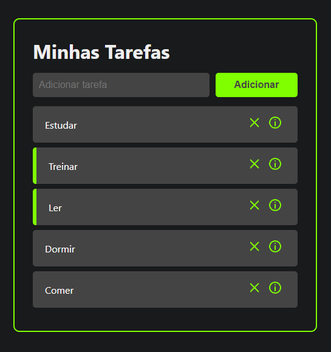

# To do app

A simple to-do list app, built with ReactJS.



## Desenvolvimento

- Clone o repositório:

```bash
$ git clone https://github.com/DiogoAMV/to-do-app.git
```

- Vá para o diretório do projeto e instale as dependências:

```bash
$ cd to-do-app && yarn install
```

- Pronto!
